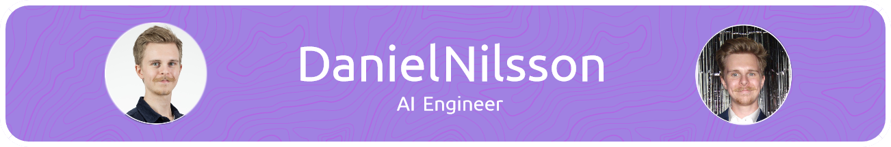

# Daniel Nilsson :computer::robot::musical_note:

Developer specializing in AI and machine learning who is passionate about tech. Currently working as a innovation developer at the consulting firm Quokka in Gothenburg, Sweden.

I'm also quite the drummer, and I love music :wink::chopsticks:

## :briefcase: Portfolio:
| Repositories                   | Description                        | Course                    |
| ------------------------------ | ---------------------------------- | ------------------------- |
|[Machine Learning Program][mla] | Classifying types with ML algorithm (KNN)    | Python Programming |
|[Geometry Shapes Class][gs]     | Used OOP to create a well-structured program | Python Programming |
|[Covid-19 Dataframe Plotting][c]| Visualizing Covid-19 data                    | Data Processing | 
| Olympics Dashboard       | Interactive dashboard about Olympics metrics | Data Processing |                                   
|[Statistical Methods][sg]       | Graphs & data created using statistical consepts| Statistical Models |
|[Personalized Recommendation System][rs] | Recommendation system for movies | Machine Learning |
|[Cardiovascular Disease Prediction][dp] | Using ML models to predict CVD | Machine Learning | 
|Blog Aggregation | Created data engineering project in a group of 4 using agile methods | Data Engineering|
|[Flower Classification][fkd] | Created neural network architecture in order to classify flowers | Deep Learning|
|[Emotion Classification with RNN][ecwr] | Created neural network architecture in order to classify emotions | Deep Learning|
|[Hate Speech Detection][hsd] | Created neural network in order to detect hate speech in a string of text | Deep Learning |

<!-- | [Programmering 1][prog1]           | first programming course (gymnasiet)   | -->

[c]: https://github.com/Danneftw1/Databehandling-Daniel-Nilsson/tree/main/Labb_1
[gs]:https://github.com/Danneftw1/Python-Daniel-Nilsson/blob/main/Labbar/geometry_shapes.py
[mla]: https://github.com/Danneftw1/Python-Daniel-Nilsson/blob/main/Labbar/Labb.ipynb
[sg]: https://github.com/Danneftw1/Statistik/blob/main/Inl%C3%A4mning.ipynb
[es]: https://github.com/Danneftw1/Portfolio-Daniel-Nilsson/blob/main/Courses_info.md
[rs]: https://github.com/Danneftw1/Machine-learning/blob/main/Labb/Labb_1_.ipynb
[dp]: https://github.com/Danneftw1/Machine-learning/tree/main/Labb
[fkd]: https://github.com/Danneftw1/Deep-Learning/blob/main/Labb_1/labb_1.ipynb
[ecwr]: https://github.com/Danneftw1/Deep-Learning/blob/main/Labb_1/labb_1.ipynb
[hsd]: https://github.com/Danneftw1/Deep-Learning/blob/main/Labb_2/Labb-2.ipynb

## 🌐 Socials:

[linkedin]: https://www.linkedin.com/in/daniel-nilsson-a3a65b241/

# 💻 Tech Stack:
                

---

<!-- Proudly created with GPRM ( https://gprm.itsvg.in ) -->
