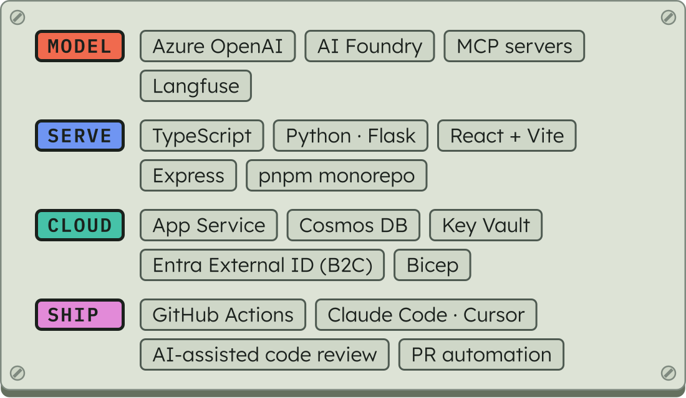
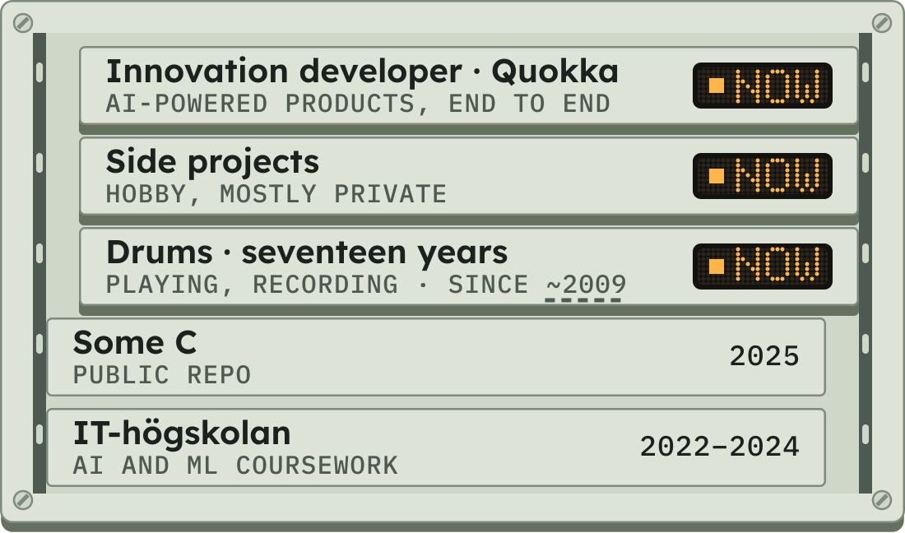

<picture>
  <source media="(prefers-reduced-motion: reduce) and (prefers-color-scheme: dark)" srcset="assets/header-static-dark.svg">
  <source media="(prefers-reduced-motion: reduce)" srcset="assets/header-static-light.svg">
  <source media="(prefers-color-scheme: dark)" srcset="assets/header-dark.svg">
  <source media="(prefers-color-scheme: light)" srcset="assets/header-light.svg">
  
</picture>

I build LLM pipelines and the products around them: multi-stage prompts, parallel model calls,
the TypeScript and Python services that run them, and the Azure infrastructure underneath.
Innovation developer at **Quokka** in Gothenburg, building AI-powered products end to end.
I have played and recorded drums for seventeen years, which is why this page is drawn as studio
hardware.

## How I build

<picture>
  <source media="(prefers-reduced-motion: reduce) and (prefers-color-scheme: dark)" srcset="assets/pipeline-static-dark.svg">
  <source media="(prefers-reduced-motion: reduce)" srcset="assets/pipeline-static-light.svg">
  <source media="(prefers-color-scheme: dark)" srcset="assets/pipeline-dark.svg">
  <source media="(prefers-color-scheme: light)" srcset="assets/pipeline-light.svg">
  
</picture>

- Multi-stage prompt design with structured output
- Parallel model calls, fan-out and fan-in, with content-filter and retry handling
- Traces, evals and prompt iteration
- Infrastructure as code and deploy pipelines

## Stack

<picture>
  <source media="(prefers-reduced-motion: reduce) and (prefers-color-scheme: dark)" srcset="assets/stack-dark.svg">
  <source media="(prefers-reduced-motion: reduce)" srcset="assets/stack-light.svg">
  <source media="(prefers-color-scheme: dark)" srcset="assets/stack-dark.svg">
  <source media="(prefers-color-scheme: light)" srcset="assets/stack-light.svg">
  
</picture>

**Model** — prompts, parallel model calls, traces and evals. Azure OpenAI · AI Foundry · MCP servers · Langfuse

**Serve** — the services and frontends the pipelines run in. TypeScript · Python/Flask · React + Vite · Express · pnpm monorepo

**Cloud** — Azure underneath, written as code. App Service · Cosmos DB · Key Vault · Entra External ID (B2C) · Bicep

**Ship** — deploy pipelines and an AI-assisted dev loop. GitHub Actions · Claude Code / Cursor workflows · AI-assisted code review and PR automation

## Record

<picture>
  <source media="(prefers-reduced-motion: reduce) and (prefers-color-scheme: dark)" srcset="assets/record-dark.svg">
  <source media="(prefers-reduced-motion: reduce)" srcset="assets/record-light.svg">
  <source media="(prefers-color-scheme: dark)" srcset="assets/record-dark.svg">
  <source media="(prefers-color-scheme: light)" srcset="assets/record-light.svg">
  
</picture>

Pulled out means current; the rest is ordered by when it ended. Only dates on record are shown.

- **Innovation developer, Quokka** — Gothenburg, now
- **Side projects** — now, hobby, mostly private
- **Drums** — playing and recording since about 2009, seventeen years
- **C** — public repo, 2025
- **IT-högskolan** — AI and machine learning studies, archived public coursework 2022–2024

## Now

- **Claude Code setup** — hooks, subagents, slash commands and MCP config, plus a plain-text ledger. Private.
- **Genealogy site** — two family lines; every fact is graded by how well it is sourced, and the grade
  decides how it is drawn: solid ink or dashed pencil. Private.
- **DSP-to-DAW map** — the signal path, from converter to timeline. Private.
- **DrumbBrain** — multi-mic drum recordings into an event stream, local-first. Research phase, no code yet.
- **Filling gaps** — networking and low-level computing.

<b>Older, and public</b> — archived coursework, 2022–2024, and some C from 2025

 

- [Machine-learning](https://github.com/Danneftw1/Machine-learning)
- [Deep-Learning](https://github.com/Danneftw1/Deep-Learning)
- [Databehandling-Daniel-Nilsson](https://github.com/Danneftw1/Databehandling-Daniel-Nilsson)
- [Data-Engineering-Agila-Metoder](https://github.com/Danneftw1/Data-Engineering-Agila-Metoder)
- [Statistik](https://github.com/Danneftw1/Statistik)
- [Linear-Algebra-Python](https://github.com/Danneftw1/Linear-Algebra-Python)
- [Python-Daniel-Nilsson](https://github.com/Danneftw1/Python-Daniel-Nilsson)
- [C](https://github.com/Danneftw1/C)

<b>Liner notes</b> — this page as plain text

 

Daniel Nilsson. LLM engineering, full-stack. Göteborg (Gothenburg), Sweden.

**Now:** innovation developer at Quokka, Gothenburg, building AI-powered products end to end:
prompt design, multi-stage LLM pipelines, TypeScript and Python services, Azure infrastructure.
Start date not listed.

**Practices:** multi-stage prompt design · structured output · content-filter and retry handling ·
parallel model calls, fan-out and fan-in · infrastructure as code · deploy pipelines · traces, evals
and prompt iteration.

**Stack:** Azure OpenAI · AI Foundry · MCP servers · Langfuse · TypeScript · Python · Flask ·
React + Vite · Express · pnpm monorepo · App Service · Cosmos DB · Key Vault · Entra External ID (B2C) ·
Bicep · GitHub Actions · Claude Code / Cursor workflows · AI-assisted code review and PR automation.

**Education:** AI and machine learning at IT-högskolan; archived public coursework, 2022–2024.
Some C, 2025.

**Side projects** (hobby, mostly private): Claude Code setup · genealogy site · DSP-to-DAW map ·
DrumbBrain (research phase, no code yet) · filling gaps in networking and low-level computing.

**Drums:** seventeen years, playing and recording.

---

The artwork is generated. [`tools/build-assets.py`](tools/build-assets.py) draws every panel in both
finishes, with and without motion, from one set of geometry and a palette it checks for contrast and
colour-blind separation first; [`tools/check-readme.mjs`](tools/check-readme.mjs) renders this README's
image blocks at 390, 430 and 896 px in both themes, in the light-on-dark view the GitHub apps show, and
with motion off, on every pull request ([`check.yml`](.github/workflows/check.yml)). Nothing here loads
from a third party.
