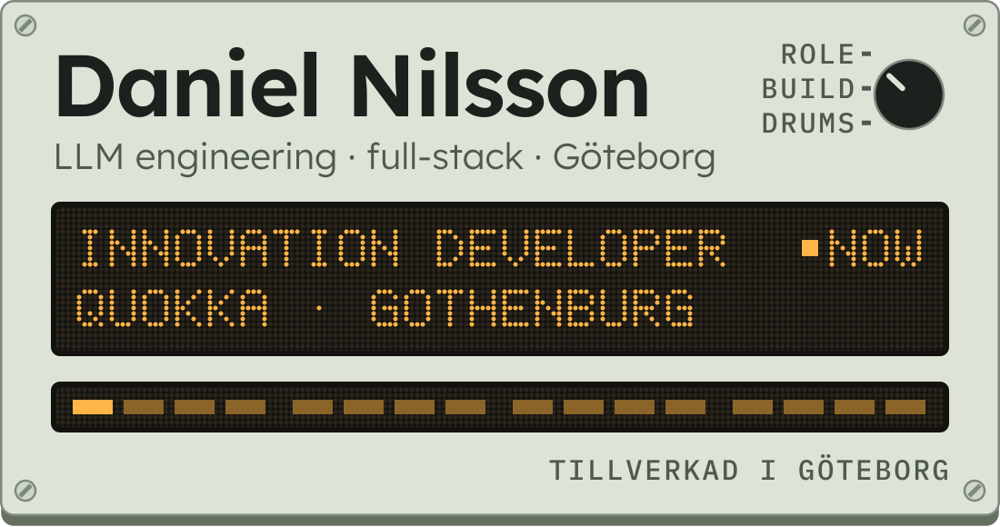
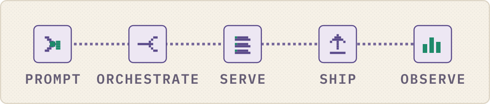

<picture>
  <source media="(prefers-reduced-motion: reduce) and (prefers-color-scheme: dark)" srcset="assets/header-static-dark.svg">
  <source media="(prefers-reduced-motion: reduce)" srcset="assets/header-static-light.svg">
  <source media="(prefers-color-scheme: dark)" srcset="assets/header-dark.svg">
  <source media="(prefers-color-scheme: light)" srcset="assets/header-light.svg">
  
</picture>

I build LLM pipelines and the products around them: prompt design, model orchestration, the
TypeScript and Python services that run them, and the Azure infrastructure underneath. Day job is
innovation developer at **Quokka** in Gothenburg, shipping AI features end to end.

Before any of that I spent seventeen years playing drums and recording them, which is where the
banner comes from: a signal goes in, gets processed in stages, and every stage gets metered. Same
habit, different units.

## The chain

<picture>
  <source media="(prefers-reduced-motion: reduce) and (prefers-color-scheme: dark)" srcset="assets/pipeline-static-dark.svg">
  <source media="(prefers-reduced-motion: reduce)" srcset="assets/pipeline-static-light.svg">
  <source media="(prefers-color-scheme: dark)" srcset="assets/pipeline-dark.svg">
  <source media="(prefers-color-scheme: light)" srcset="assets/pipeline-light.svg">
  
</picture>

**Prompt** — multi-stage prompt design, structured output, content-filter and retry handling.

**Orchestrate** — parallel model calls, fan-out and fan-in, and a sane answer when one stage fails.
`Azure OpenAI` · `AI Foundry`

**Serve** — React + Vite frontends, Express APIs, Python/Flask AI services, one pnpm monorepo.
`TypeScript` · `Python` · `React`

**Ship** — infrastructure as code, deploy pipelines. `Bicep` · `App Service` · `Cosmos DB` ·
`Key Vault` · `Entra External ID` · `GitHub Actions`

**Observe** — traces, evals and prompt iteration. `Langfuse`

## Now

- **Claude Code setup** — hooks, subagents, slash commands and MCP config under version control,
  plus a plain-text ledger of what each session changed, so I can read a page instead of a
  transcript. `private`
- **A genealogy site** — two family lines, every fact graded by how well it is sourced, and the
  grade decides how the fact is drawn: sourced is solid ink, a guess is a thin dashed pencil line.
  `private`
- **DSP-to-DAW map** — the signal path from converter to timeline, and what each stage is actually
  called. `private`
- **DrumbBrain** — turning multi-mic drum recordings into an event stream, local-first. Research
  phase, no code yet. `no code yet`
- **Filling gaps** — networking and low-level computing.

Most of this is private; it is hobby work and half of it is notes. The public repos below are older,
from my AI and machine learning studies at IT-högskolan.

<b>Older, and public</b> — archived coursework, 2022–2024, and some C from 2025

 

- [**Machine-learning**](https://github.com/Danneftw1/Machine-learning) — supervised learning and
  model selection in scikit-learn
- [**Deep-Learning**](https://github.com/Danneftw1/Deep-Learning) — neural networks, course work
- [**Databehandling-Daniel-Nilsson**](https://github.com/Danneftw1/Databehandling-Daniel-Nilsson) —
  data wrangling and visualisation, including an Olympics dashboard
- [**Data-Engineering-Agila-Metoder**](https://github.com/Danneftw1/Data-Engineering-Agila-Metoder)
  — pipelines and Python in a group project
- [**Statistik**](https://github.com/Danneftw1/Statistik) and
  [**Linear-Algebra-Python**](https://github.com/Danneftw1/Linear-Algebra-Python) — the maths, in
  notebooks
- [**Python-Daniel-Nilsson**](https://github.com/Danneftw1/Python-Daniel-Nilsson) — fundamentals
- [**C**](https://github.com/Danneftw1/C) — very C

---

The artwork is generated. [`tools/build-assets.py`](tools/build-assets.py) draws every asset — both
themes, with and without motion — from one set of geometry and a palette it contrast-checks first;
[`tools/check-readme.mjs`](tools/check-readme.mjs) renders this README's image blocks at 390, 430 and
896 px in both themes, plus the light-on-dark fallback the mobile apps show, on every pull request
([`check.yml`](.github/workflows/check.yml)). No badge services or stats widgets — nothing here loads
from a third party.
