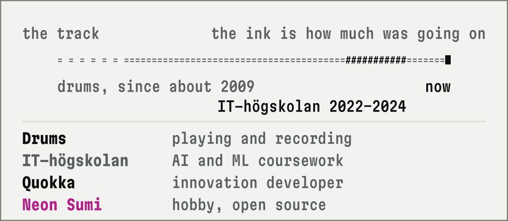

<picture>
  <source media="(prefers-reduced-motion: reduce) and (prefers-color-scheme: dark)" srcset="assets/header-static-dark.svg">
  <source media="(prefers-reduced-motion: reduce)" srcset="assets/header-static-light.svg">
  <source media="(prefers-color-scheme: dark)" srcset="assets/header-dark.svg">
  <source media="(prefers-color-scheme: light)" srcset="assets/header-light.svg">
  
</picture>

Exploratory developer in Gothenburg. At **Quokka** I build AI-powered products end to end:
multi-stage prompts, parallel model calls, the TypeScript and Python services that run them and
the Azure infrastructure underneath. On my own time I build
[Neon Sumi](https://github.com/Danneftw1/neon-sumi), an open-source status line for Claude
Code. I have played drums for seventeen years and record them multi-mic,
never quantized: the hits land where they land.

The page is drawn in Tecken, the character-cell design system my project hub runs on, cut
heavier: one face, square cells, the inverse cell for what is current. Its one colour is
Neon Sumi's magenta, kept for the one project that broke free of the hub and wears its own
design.

## How I build

<picture>
  <source media="(prefers-reduced-motion: reduce) and (prefers-color-scheme: dark)" srcset="assets/pipeline-static-dark.svg">
  <source media="(prefers-reduced-motion: reduce)" srcset="assets/pipeline-static-light.svg">
  <source media="(prefers-color-scheme: dark)" srcset="assets/pipeline-dark.svg">
  <source media="(prefers-color-scheme: light)" srcset="assets/pipeline-light.svg">
  
</picture>

- Multi-stage prompt design with structured output
- Parallel model calls, fan-out and fan-in, with content-filter and retry handling
- Traces, evals and prompt iteration
- Infrastructure as code and deploy pipelines

## Stack

<picture>
  <source media="(prefers-reduced-motion: reduce) and (prefers-color-scheme: dark)" srcset="assets/stack-dark.svg">
  <source media="(prefers-reduced-motion: reduce)" srcset="assets/stack-light.svg">
  <source media="(prefers-color-scheme: dark)" srcset="assets/stack-dark.svg">
  <source media="(prefers-color-scheme: light)" srcset="assets/stack-light.svg">
  
</picture>

**Model** — prompts, parallel model calls, traces and evals. Azure OpenAI · Microsoft Foundry · MCP servers · Langfuse

**Serve** — the services and frontends the pipelines run in. TypeScript · Python/Flask · React + Vite · Express · pnpm monorepo

**Cloud** — Azure underneath, written as code. App Service · Cosmos DB · Key Vault · Entra External ID (B2C) · Bicep

**Ship** — deploy pipelines and an AI-assisted dev loop. GitHub Actions · Claude Code / Cursor workflows · AI-assisted code review and PR automation

## Record

<picture>
  <source media="(prefers-reduced-motion: reduce) and (prefers-color-scheme: dark)" srcset="assets/record-dark.svg">
  <source media="(prefers-reduced-motion: reduce)" srcset="assets/record-light.svg">
  <source media="(prefers-color-scheme: dark)" srcset="assets/record-dark.svg">
  <source media="(prefers-color-scheme: light)" srcset="assets/record-light.svg">
  
</picture>

Lit means current; the rest is ordered by when it ended. Only dates on record are shown.

- **Innovation developer, Quokka** — Gothenburg, now
- **Side projects** — now, hobby, mostly private
- **Neon Sumi** — a status line for Claude Code, open source, now
- **Drums** — playing and recording since about 2009, seventeen years
- **Keyboards** — building and modding mechanical keyboards since 2012
- **IT-högskolan** — AI and machine learning programme, 2022–2024, archived public coursework

## Now

- **[Neon Sumi](https://github.com/Danneftw1/neon-sumi)** — a status line for Claude Code that shows
  context, limits, the PR and the ports that are up, with matching themes for Ghostty and Obsidian.
  Free and open source.
- **Recording pipeline** — from behind the kit to a finished video, multi-mic audio and multi-angle video,
  with as little manual work in between as possible. Private.
- **DrumbBrain** — reads my own drum recordings into a profile of how I play: what I lean on and what is
  left to explore. Local-first. Research phase, no code yet.
- **Claude Code setup** — hooks, subagents, slash commands and MCP config, plus a plain-text ledger. Private.
- **Genealogy site** — two family lines; every fact is graded by how well it is sourced, and the grade
  decides how it is drawn: solid ink or dashed pencil. Private.
- **DSP-to-DAW map** — the signal path, from converter to timeline. Private.
- **Filling gaps** — networking and low-level computing.

<b>Older, and public</b> — archived coursework, 2022–2024

 

- [Machine-learning](https://github.com/Danneftw1/Machine-learning)
- [Deep-Learning](https://github.com/Danneftw1/Deep-Learning)
- [Databehandling-Daniel-Nilsson](https://github.com/Danneftw1/Databehandling-Daniel-Nilsson)
- [Data-Engineering-Agila-Metoder](https://github.com/Danneftw1/Data-Engineering-Agila-Metoder)
- [Statistik](https://github.com/Danneftw1/Statistik)
- [Linear-Algebra-Python](https://github.com/Danneftw1/Linear-Algebra-Python)
- [Python-Daniel-Nilsson](https://github.com/Danneftw1/Python-Daniel-Nilsson)

<b>Liner notes</b> — this page as plain text

 

Daniel Nilsson. Exploratory developer and drummer. Göteborg (Gothenburg), Sweden.

**Now:** innovation developer at Quokka, Gothenburg, building AI-powered products end to end:
prompt design, multi-stage LLM pipelines, TypeScript and Python services, Azure infrastructure.
Start date not listed.

**Practices:** multi-stage prompt design · structured output · content-filter and retry handling ·
parallel model calls, fan-out and fan-in · infrastructure as code · deploy pipelines · traces, evals
and prompt iteration.

**Stack:** Azure OpenAI · Microsoft Foundry · MCP servers · Langfuse · TypeScript · Python · Flask ·
React + Vite · Express · pnpm monorepo · App Service · Cosmos DB · Key Vault · Entra External ID (B2C) ·
Bicep · GitHub Actions · Claude Code / Cursor workflows · AI-assisted code review and PR automation.

**Education:** AI and machine learning programme at IT-högskolan, 2022–2024; archived public coursework.

**Neon Sumi:** an open-source status line for Claude Code, with matching themes.

**Side projects** (hobby, mostly private): recording pipeline · DrumbBrain (research phase, no code yet) ·
Claude Code setup · genealogy site · DSP-to-DAW map · filling gaps in networking and low-level computing.

**Drums:** seventeen years, playing and recording, multi-mic, never quantized.

**Keyboards:** building and modding mechanical keyboards since 2012.

---

The artwork is generated. [`tools/build-assets.py`](tools/build-assets.py) draws every panel in
Tecken, with and without motion, from one set of geometry — the wheel is rendered frame by frame as
text characters, the way donut.c draws its torus — and checks the palette for contrast and
colour-blind separation first; [`tools/check-readme.mjs`](tools/check-readme.mjs) renders this README's
image blocks at 390, 430 and 896 px in both themes, in the light-on-dark view the GitHub apps show, and
with motion off, on every pull request ([`check.yml`](.github/workflows/check.yml)). Nothing here loads
from a third party.
