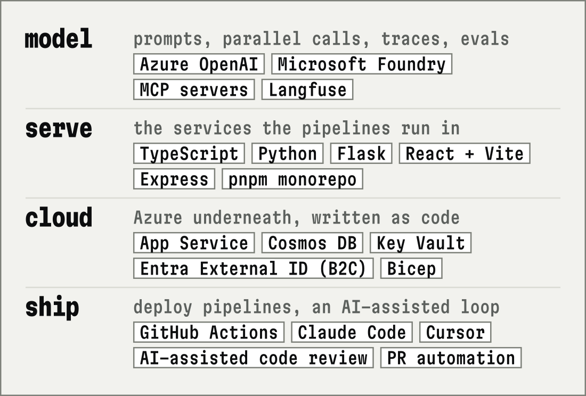

<picture>
  <source media="(prefers-reduced-motion: reduce) and (prefers-color-scheme: dark)" srcset="assets/header-static-dark.svg">
  <source media="(prefers-reduced-motion: reduce)" srcset="assets/header-static-light.svg">
  <source media="(prefers-color-scheme: dark)" srcset="assets/header-dark.svg">
  <source media="(prefers-color-scheme: light)" srcset="assets/header-light.svg">
  
</picture>

I build LLM pipelines and the products around them: multi-stage prompts, parallel model calls,
the TypeScript and Python services that run them, and the Azure infrastructure underneath.
Innovation developer at **Quokka** in Gothenburg, building AI-powered products end to end.
I have played and recorded drums for seventeen years.

## How I build

<picture>
  <source media="(prefers-reduced-motion: reduce) and (prefers-color-scheme: dark)" srcset="assets/pipeline-dark.svg">
  <source media="(prefers-reduced-motion: reduce)" srcset="assets/pipeline-light.svg">
  <source media="(prefers-color-scheme: dark)" srcset="assets/pipeline-dark.svg">
  <source media="(prefers-color-scheme: light)" srcset="assets/pipeline-light.svg">
  
</picture>

## Stack

<picture>
  <source media="(prefers-reduced-motion: reduce) and (prefers-color-scheme: dark)" srcset="assets/stack-dark.svg">
  <source media="(prefers-reduced-motion: reduce)" srcset="assets/stack-light.svg">
  <source media="(prefers-color-scheme: dark)" srcset="assets/stack-dark.svg">
  <source media="(prefers-color-scheme: light)" srcset="assets/stack-light.svg">
  
</picture>

## Record

<picture>
  <source media="(prefers-reduced-motion: reduce) and (prefers-color-scheme: dark)" srcset="assets/record-dark.svg">
  <source media="(prefers-reduced-motion: reduce)" srcset="assets/record-light.svg">
  <source media="(prefers-color-scheme: dark)" srcset="assets/record-dark.svg">
  <source media="(prefers-color-scheme: light)" srcset="assets/record-light.svg">
  
</picture>

## Now

- **[Neon Sumi](https://github.com/Danneftw1/neon-sumi)** — a status line for Claude Code that
  shows context, limits, the PR and the ports that are up. Free and open source.
- **Claude Code setup** — hooks, subagents, slash commands and MCP config, plus a plain-text ledger. Private.
- **Genealogy site** — two family lines; every fact is graded by how well it is sourced, and the grade
  decides how it is drawn: solid ink or dashed pencil. Private.
- **DSP-to-DAW map** — the signal path, from converter to timeline. Private.
- **DrumbBrain** — multi-mic drum recordings into an event stream, local-first. Research phase, no code yet.
- **Filling gaps** — networking and low-level computing.

<b>Older, and public</b> — archived coursework, 2022–2024, and some C from 2025

 

- [Machine-learning](https://github.com/Danneftw1/Machine-learning)
- [Deep-Learning](https://github.com/Danneftw1/Deep-Learning)
- [Databehandling-Daniel-Nilsson](https://github.com/Danneftw1/Databehandling-Daniel-Nilsson)
- [Data-Engineering-Agila-Metoder](https://github.com/Danneftw1/Data-Engineering-Agila-Metoder)
- [Statistik](https://github.com/Danneftw1/Statistik)
- [Linear-Algebra-Python](https://github.com/Danneftw1/Linear-Algebra-Python)
- [Python-Daniel-Nilsson](https://github.com/Danneftw1/Python-Daniel-Nilsson)
- [C](https://github.com/Danneftw1/C)

<b>Liner notes</b> — this page as plain text

 

Daniel Nilsson. AI engineer: LLM engineering, full-stack. Göteborg (Gothenburg), Sweden.

**Now:** innovation developer at Quokka, Gothenburg, building AI-powered products end to end:
prompt design, multi-stage LLM pipelines, TypeScript and Python services, Azure infrastructure.
Start date not listed.

**Practices:** multi-stage prompt design · structured output · content-filter and retry handling ·
parallel model calls, fan-out and fan-in · infrastructure as code · deploy pipelines · traces, evals
and prompt iteration.

**Stack:** Azure OpenAI · Microsoft Foundry · MCP servers · Langfuse · TypeScript · Python · Flask ·
React + Vite · Express · pnpm monorepo · App Service · Cosmos DB · Key Vault · Entra External ID (B2C) ·
Bicep · GitHub Actions · Claude Code / Cursor workflows · AI-assisted code review and PR automation.

**Education:** AI and machine learning at IT-högskolan; archived public coursework, 2022–2024.
Some C, 2025.

**Side projects** (hobby, mostly private): Neon Sumi, an open-source status line for Claude Code ·
Claude Code setup · genealogy site · DSP-to-DAW map ·
DrumbBrain (research phase, no code yet) · filling gaps in networking and low-level computing.

**Drums:** seventeen years, playing and recording.

---

The page is drawn in Tecken, the character-cell design system my project hub runs on, cut heavier:
one face, square cells, the inverse cell for what is current, and Neon Sumi's magenta only for the one project that
broke free and wears its own design. The artwork is generated. [`tools/build-assets.py`](tools/build-assets.py) draws every panel in
Tecken, with and without motion, from one set of geometry — the wheel is rendered frame by frame as
text characters, the way donut.c draws its torus — and checks the palette for contrast and
colour-blind separation first; [`tools/check-readme.mjs`](tools/check-readme.mjs) renders this README's
image blocks at 390, 430 and 896 px in both themes, in the light-on-dark view the GitHub apps show, and
with motion off, on every pull request ([`check.yml`](.github/workflows/check.yml)). Nothing here loads
from a third party.
